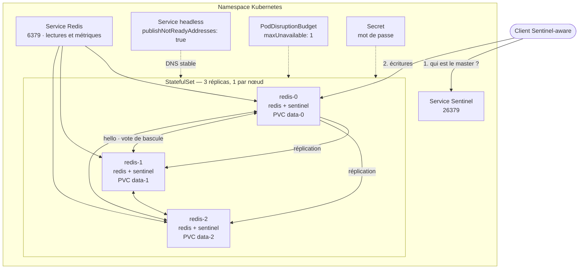

# helm-redis

Chart Helm pour déployer un **groupe Redis hautement disponible** sur Kubernetes —
sans opérateur, sans CRD, sans dépendance externe.

Réplication master/replica, bascule automatique par **Redis Sentinel**,
`min-replicas-to-write`, anti-affinité, PodDisruptionBudget, métriques Prometheus.
Livré avec un banc de test de bout en bout sur KinD qui **tue brutalement le
master** et vérifie qu'un replica est promu, que les écritures reprennent et
qu'aucune donnée n'est perdue.

> **État :** validé sur Kubernetes 1.30.8 — **33/33 vérifications**, dont la
> promotion d'un replica après la perte brutale du master, l'écriture pendant la
> panne, le retour de l'ancien master en replica, et la remontée des métriques
> jusqu'au dashboard Grafana.

---

## Sommaire

- [Démarrage rapide](#démarrage-rapide)
- [Architecture](#architecture)
- [Ce que la HA couvre](#ce-que-la-ha-couvre)
- [Structure du dépôt](#structure-du-dépôt)
- [Makefile](#makefile)
- [Scénarios de test](#scénarios-de-test)
- [Prérequis de la machine de test](#prérequis-de-la-machine-de-test)
- [Journal de validation](#journal-de-validation)
- [Aller plus loin](#aller-plus-loin)

---

## Démarrage rapide

```bash
# Vérifications hors cluster (lint + schémas Kubernetes, ~10 s)
make check

# Test complet sur un cluster KinD jetable (~7 min)
make test-kind

# Déploiement sur le cluster de votre contexte kubectl courant
make install NAMESPACE=datastore
make test        # helm test : réplication et accord des sentinels
make password    # mot de passe généré
make master      # adresse du master courant
make cli         # redis-cli branché sur le master
```

Sans `make`, tout reste utilisable directement :

```bash
helm install redis ./redis-ha -n datastore --create-namespace
helm install redis ./redis-ha -n datastore -f redis-ha/ci/production-values.yaml
./scripts/test-kind.sh --k8s-version 1.31.4 --replicas 5
```

---

## Architecture



**Élection du rôle.** Rien n'est figé dans le manifeste. Au démarrage, chaque pod
demande le master courant aux sentinels de ses pairs, puis se déclare master ou
`replicaof`. Si aucun pair ne répond — arrêt complet du groupe — il relit l'état
que Sentinel a persisté sur son propre PVC ; le pod 0 n'est le master que par
défaut, au tout premier démarrage.

**Bascule.** Les trois sentinels surveillent le master. Passé
`down-after-milliseconds` (5 s), une majorité stricte doit s'accorder pour
promouvoir un replica, puis les autres sont reconfigurés automatiquement.

**Adressage.** Les pods changent d'IP à chaque recréation. Le groupe raisonne donc
exclusivement en noms DNS (`replica-announce-ip`, `sentinel resolve-hostnames`),
y compris dans l'adresse de master servie aux clients.

**Durabilité.** `min-replicas-to-write 1` : un master qui n'a plus de replica à
jour **refuse** les écritures, plutôt que d'en accepter qui seraient perdues à la
promotion suivante. AOF `everysec` + RDB sur un PVC par pod.

---

## Ce que la HA couvre

| Risque | Réponse du chart |
|---|---|
| Perte du pod master | 3 sentinels co-localisés, promotion automatique d'un replica |
| Perte d'un nœud Kubernetes | StatefulSet 3 réplicas + anti-affinité (`soft` par défaut, `hard` possible) |
| Perte de données à la bascule | `min-replicas-to-write 1` : le master isolé refuse les écritures |
| Perte de données au crash | AOF `everysec` + RDB, un PVC par pod |
| Adresse du master qui change | Noms DNS partout (`resolve-hostnames`), jamais d'IP de pod |
| Drain simultané de plusieurs nœuds | PodDisruptionBudget `maxUnavailable: 1` — la majorité des sentinels est préservée |
| Rolling update qui coupe le service | `preStop` : bascule volontaire demandée à un sentinel **pair** avant l'arrêt |
| Arrêt complet du groupe | L'état Sentinel vit sur le PVC : le dernier master connu est retrouvé au redémarrage |
| Sentinels fantômes après redémarrage | `sentinel myid` déterministe (SHA-1 du nom du pod) |
| Saturation mémoire → OOMKill | `maxmemory` calculé depuis `resources.limits.memory` |
| Panne silencieuse | Probes `redis-cli`, deux exporters Prometheus, `PrometheusRule` |

Détail des valeurs et des choix de conception : **[redis-ha/README.md](redis-ha/README.md)**.

---

## Structure du dépôt

```
.
├── Makefile                          # points d'entrée : check, test-*, install, ...
├── README.md                         # ce fichier
├── redis-ha/                         # le chart
│   ├── Chart.yaml                    # Redis 7.4.5
│   ├── values.yaml                   # valeurs commentées
│   ├── README.md                     # référence des values + runbook
│   ├── ci/
│   │   ├── production-values.yaml    # 5 nœuds, anti-affinité stricte, monitoring
│   │   ├── ephemeral-values.yaml     # sans persistance (tests jetables)
│   │   ├── sessions-values.yaml      # magasin de sessions : dispo > durabilite
│   │   ├── sessions-external-values.yaml # surcouche : clients hors cluster
│   │   └── envoy-gateway-values.yaml # exposition Gateway API
│   └── templates/
│       ├── statefulset.yaml          # redis + sentinel + 2 exporters par pod
│       ├── configmap.yaml            # modèles de conf ET scripts de démarrage
│       ├── secret.yaml               # mot de passe, conservé entre upgrades
│       ├── rbac.yaml                 # ServiceAccount sans jeton monté
│       ├── services.yaml             # headless + sentinel + redis
│       ├── poddisruptionbudget.yaml
│       ├── metrics.yaml              # ServiceMonitor + PrometheusRule
│       ├── networkpolicy.yaml
│       ├── envoy-gateway.yaml        # Gateway + TCPRoute + policies Envoy
│       ├── NOTES.txt
│       └── tests/test-failover.yaml  # helm test
├── scripts/
│   └── test-kind.sh                  # banc de test de bout en bout
└── test/monitoring/                  # stack d'observabilité du banc de test
    ├── prometheus.yaml               # scrape des deux exporters + RBAC
    ├── grafana.yaml                  # datasource et dashboard provisionnés
    └── dashboard-redis.json          # le dashboard
```

> **Pas d'Ingress** ici, contrairement à un chart RabbitMQ : Redis ne parle pas
> HTTP et n'a pas de console. L'exposition hors cluster passe par
> `service.type: LoadBalancer` / `NodePort`, ou par **Envoy Gateway**
> (`envoyGateway.enabled=true`, voir
> [redis-ha/README.md](redis-ha/README.md#exposition-via-envoy-gateway)) : le
> chart produit alors `Gateway` + `TCPRoute`, et fait sonder les endpoints par
> Envoy pour ne router que vers le master courant.

---

## Makefile

`make` seul affiche l'aide. Toutes les variables se surchargent en ligne de commande :
`make test-kind K8S_VERSION=1.31.4 REPLICAS=5 NAMESPACE=prod`.

### Vérifications hors cluster

| Cible | Effet |
|---|---|
| `make lint` | `helm lint --strict` sur les 6 combinaisons de values |
| `make render` | Rend 8 profils de manifestes dans `.out/` |
| `make validate` | Valide ces manifestes contre les schémas Kubernetes via kubeconform (Docker), repli sur `kubectl --dry-run=client` |
| `make check` | `lint` + `validate` — à lancer avant tout commit |

### Tests de bout en bout (KinD)

| Cible | Scénario |
|---|---|
| `make test-kind` | Nominal : 3 nœuds sur 3 workers, Kubernetes 1.30.8, avec perte brutale du master |
| `make test-ha5` | 5 nœuds sur 5 workers |
| `make test-ephemeral` | Sans persistance (`emptyDir`, PDB désactivé) |
| `make test-monitoring` | Nominal **+ Prometheus/Grafana** : vérifie que les métriques du chart remontent jusqu'au dashboard |
| `make test-envoy` | Nominal **+ Envoy Gateway** : vérifie que le gateway ne sert que le master, avant et après la bascule |
| `make test-sessions` | Profil magasin de sessions : 5 nœuds sur 5 workers, disponibilité avant durabilité, avec gateway |

> Toutes les cibles `test-*` **détruisent le cluster** en sortant. Pour garder un
> cluster utilisable après coup — et pouvoir ouvrir Grafana — passer par
> `make monitoring-up` ou `make kind-up`, qui font la même chose avec `--keep`.
| `make test-matrix` | Rejoue le scénario nominal sur 1.29.12, 1.30.8 et 1.31.4 |
| `make test-kind-keep` | Idem nominal, mais conserve le cluster pour investigation |
| `make test-all` | `check` puis scénario nominal |

### Cluster de développement

| Cible | Effet |
|---|---|
| `make kind-up` | Crée le cluster KinD, installe le chart et **le laisse en place** |
| `make kind-status` | Pods, PVC, Services et `sentinel master` |
| `make monitoring-up` | Cluster + chart + Prometheus/Grafana, conservés |
| `make grafana` | Port-forward de Grafana sur `http://127.0.0.1:3000` |
| `make prometheus` | Port-forward de Prometheus sur `http://127.0.0.1:9090` |
| `make kind-down` | Détruit le cluster |

### Déploiement sur le contexte kubectl courant

| Cible | Effet |
|---|---|
| `make install` / `make install-prod` | `helm upgrade --install` (profil défaut ou production) |
| `make test` | `helm test --logs` |
| `make status` | `helm status` + état vu par Sentinel |
| `make master` | Adresse du master courant |
| `make cli` | `redis-cli` branché sur le master courant |
| `make failover` | Force une bascule (test de reprise, hors production) |
| `make password` | Affiche le mot de passe généré |
| `make uninstall` | Désinstalle la release (PVC et Secret conservés) |
| `make package` | Empaquette le chart en `.tgz` dans `.out/` |

---

## Scénarios de test

`scripts/test-kind.sh` est autonome (utilisable sans `make`) et enchaîne :

1. **Préflight** — binaires requis, daemon Docker, limites inotify de l'hôte,
   version de kind, autres clusters KinD actifs.
2. **Création du cluster** — 1 control-plane + N workers à la version demandée,
   puis préchargement de toutes les images référencées par le chart.
3. **Déploiement** — `helm upgrade --install --wait` avec anti-affinité **stricte**,
   afin que la répartition des pods soit réellement contrainte.
4. **Vérifications d'infrastructure** — pods Ready, PVC Bound, un pod par nœud,
   `disruptionsAllowed = 1`.
5. **Vérifications du groupe** — un unique master, tous les sentinels d'accord,
   chacun connaissant ses pairs, N-1 replicas attachés, mot de passe réellement
   exigé, `maxmemory` bien calculé depuis la limite du conteneur, `helm test`.
6. **Scénario de panne** — c'est le cœur du test :

   ```
   écriture + WAIT 2            →  répliquée sur les 2 replicas
   lecture sur un replica       →  même valeur
   suppression BRUTALE du master →  --grace-period=1, le preStop est court-circuité
   bascule Sentinel             →  nouveau master ≠ ancien
   écriture PENDANT la panne    →  acceptée par le nouveau master
   relecture de la clé d'avant  →  intacte
   retour de l'ancien master    →  revient en REPLICA, lien de réplication up
   les 2 clés sur les 3 nœuds   →  aucune divergence
   ```

7. **Métriques** — les deux endpoints `/metrics` exposent bien `redis_*` et
   `redis_sentinel_*`.

La suppression du master utilise `--grace-period=1` **volontairement** : le hook
`preStop` n'a pas le temps de céder la place, on teste donc la vraie panne (le
nœud disparaît sans prévenir) et non l'arrêt propre.

### Envoy Gateway (`--envoy-gateway`)

Avec ce drapeau, le script installe Envoy Gateway et une `GatewayClass`, déploie
le chart avec `envoyGateway.enabled=true`, puis vérifie **ce qui se passe
réellement dans le chemin de données** :

```
Gateway accepté, TCPRoute acceptée et backend résolu
connexion à travers le proxy Envoy   →  role = master
identité du pod servi                →  == master désigné par Sentinel
écriture à travers le gateway        →  OK
contre-épreuve : 12 connexions au Service Redis  →  master ET slave
suppression brutale du master        →  bascule Sentinel
connexion à travers le gateway       →  role = master, NOUVEAU pod
écriture à travers le gateway        →  OK
```

La contre-épreuve est le cœur du test : le Service Redis, lui, répartit bien sur
tous les pods. C'est exactement ce que la sélection d'endpoint du gateway évite.

Le scénario installe **Envoy Gateway 1.6.7** (`EG_VERSION`), la seule branche
encore compatible avec la version de Kubernetes par défaut du banc : chaque
branche a sa fenêtre, et à partir de la 1.7 les CRD Gateway API embarquées
utilisent la fonction CEL `isIP()`, absente avant Kubernetes 1.32.

| Envoy Gateway | Gateway API | Kubernetes |
|---|---|---|
| 1.6.x | 1.4.0 | 1.30 → 1.33 |
| 1.7.x | 1.4.1 | 1.32 → 1.35 |
| 1.8.x | 1.5.1 | 1.32 → 1.35 |

Le script déduit la version minimale de `EG_VERSION` et refuse de démarrer en
dehors de la fenêtre, plutôt que de laisser échouer l'installation des CRD sur un
message obscur. Pour tester une branche plus récente, surcharger les deux :
`make test-envoy EG_VERSION=v1.8.3 ENVOY_K8S_VERSION=1.33.12`.

Le chart, lui, n'utilise que des champs présents depuis Envoy Gateway 1.6
(`panicThreshold`, sonde TCP `send`/`receive`, TLS `Terminate` + `TCPRoute`).

En KinD, le `Gateway` reste `Programmed: False` / `AddressNotAssigned` : aucun
fournisseur de LoadBalancer n'attribue d'adresse externe. Le plan de données est
en place malgré tout — c'est ce que prouvent les connexions ci-dessus.

### Observabilité (`--monitoring`)

Avec ce drapeau, le script déploie dans le namespace `monitoring` un Prometheus
et un Grafana minimaux (`test/monitoring/`), **avant** le scénario de panne — le
dashboard capture donc la bascule et la reprise.

- **Prometheus** découvre les pods Redis par label via l'API Kubernetes (Role
  limité au namespace du chart) et distingue les deux exporters par le nom du
  port du conteneur : job `redis` (9121) et job `redis-sentinel` (9122).
  `instance` est réétiqueté avec le nom du pod, pour des légendes lisibles.
- **Grafana** provisionne la datasource et le dashboard
  [`test/monitoring/dashboard-redis.json`](test/monitoring/dashboard-redis.json) :
  6 tuiles (nœuds up, master unique, replicas attachés, sentinels utilisables,
  clients, clés) et 8 graphes (débit, replicas par pod, mémoire face à
  `maxmemory`, lien de réplication, retard de réplication, clés par pod, vue
  Sentinel du groupe, santé du master). Accès anonyme, le dashboard s'ouvre en
  page d'accueil.

Des vérifications s'ajoutent : cibles scrapées pour les deux jobs, master unique
vu par Prometheus, santé de Grafana, datasource provisionnée, dashboard présent,
et requête servie à travers le proxy Grafana. **Chaque expression du dashboard
est rejouée contre Prometheus** — le test échoue si l'une d'elles ne renvoie
rien, ce qui attrape tout nom de métrique erroné.

```bash
make monitoring-up   # cluster + chart + stack, conservés
make grafana         # puis http://127.0.0.1:3000
```

Nettoyage systématique par `trap` (port-forward, fichiers temporaires, cluster),
sauf `--keep`. Le script sort en code non nul dès qu'une assertion échoue.

Options : `--k8s-version`, `--replicas`, `--workers`, `--cluster`, `--namespace`,
`--release`, `--values <fichier>`, `--keep`, `--reuse`, `--skip-preload`,
`--skip-sysctl-check`, `--monitoring`. Détail : `./scripts/test-kind.sh --help`.

---

## Prérequis de la machine de test

`docker`, `kind`, `kubectl`, `helm`, `curl`, `jq`.

**Limites inotify.** Un cluster KinD multi-nœuds épuise les valeurs par défaut de
beaucoup de distributions. Symptôme : `kube-proxy` en CrashLoopBackOff avec
`too many open files`, workers incapables de rejoindre le cluster, et un kubeadm qui
se plaint de `could not find a JWS signature in the cluster-info ConfigMap`.

Correction temporaire, jusqu'au redémarrage :

```bash
sudo sysctl -w fs.inotify.max_user_instances=512 fs.inotify.max_user_watches=524288
```

Ou de façon permanente, en deux commandes distinctes — écrire le fichier, puis le
charger :

```bash
echo -e "fs.inotify.max_user_instances=512\nfs.inotify.max_user_watches=524288" \
  | sudo tee /etc/sysctl.d/99-kind.conf
sudo sysctl -p /etc/sysctl.d/99-kind.conf
```

> **Les deux commandes comptent.** Enchaînées en une seule ligne avec `&&`, le second
> `sudo` peut redemander le mot de passe et être abandonné : le fichier est alors bien
> écrit, mais la limite active reste inchangée et le préflight rejoue la même erreur au
> `make` suivant. En cas de doute, vérifier la valeur réellement appliquée :
>
> ```bash
> sysctl fs.inotify.max_user_instances
> ```
>
> Si elle est encore trop basse alors que `/etc/sysctl.d/99-kind.conf` existe, il ne
> manque que le `sysctl -p`. Le réglage serait de toute façon actif au prochain
> redémarrage.

Le script vérifie ces limites avant de créer quoi que ce soit :
`max_user_instances` sous le seuil est **bloquant** (c'est ce qui casse `kube-proxy`),
`max_user_watches` ne déclenche qu'un avertissement — 65536 suffit en pratique pour
un cluster de 4 nœuds. Pour passer outre : `--skip-sysctl-check`.

**Version de kind.** L'image `kindest/node:v1.30.8` est publiée avec kind ≥ 0.26.0.
Le script avertit si le vôtre est plus ancien — en pratique kind 0.20.0 démarre
correctement cette image, l'avertissement reste indicatif.

**Autres clusters KinD.** Ils consomment les mêmes limites : le script les signale.

---

## Journal de validation

Le banc de test n'est pas décoratif — voici les défauts réels du chart qu'il a
trouvés, tous corrigés :

| Défaut | Symptôme observé | Correctif |
|---|---|---|
| Réécriture chirurgicale de `sentinel.conf` | Sentinel réorganise librement le fichier qu'il réécrit pour y consigner son état. Le bloc de surcharges du chart, délimité par un commentaire et retiré au démarrage suivant, emportait avec lui la ligne `sentinel monitor` que Sentinel y avait déplacée : `FATAL CONFIG FILE ERROR ... No such master with specified name`, un démarrage sur deux, CrashLoopBackOff | Configuration régénérée intégralement à chaque démarrage (écriture atomique), le dernier master connu étant relu dans l'ancien fichier **avant** de l'écraser |
| `chmod` après l'écriture au lieu d'avant | Le ConfigMap est monté en 0444 et `cp` reprend les droits de la source : les ajouts au fichier généré échouaient. Pire, l'erreur n'arrêtait pas le script — Sentinel démarrait **sans mot de passe et sans master à surveiller**, et le groupe ne se formait jamais | `chmod 600` juste après le `cp`, plus un garde-fou qui refuse de démarrer si `sentinel monitor` ou `requirepass` manque dans la configuration produite |
| Course DNS au tout premier démarrage | `sentinel resolve-hostnames yes` fait résoudre le nom du master à la lecture du fichier : Sentinel refuse de démarrer si l'entrée DNS du pod n'est pas encore publiée | `wait_for_dns` avant `exec`, dans les deux scripts de démarrage |

Résultat du run de référence avec `--monitoring` (Kubernetes 1.30.8, 3 nœuds) :

```
[OK] Version du serveur Kubernetes (=v1.30.8)  [OK] Pods Ready (=3)
[OK] PVC Bound (=3)                            [OK] Pods sur des noeuds distincts (=3)
[OK] PDB : disruptions autorisees (=1)         [OK] Sentinels d'accord sur un unique master (=1)
[OK] Sentinels connaissant tous leurs pairs (=3)
[OK] Replicas attaches au master (=2)          [OK] Roles dans le groupe (=1 master 2 slave)
[OK] Authentification exigee par Redis
[OK] maxmemory calcule depuis la limite du conteneur (=322122547)
[OK] helm test
[OK] Ecriture avant panne repliquee (WAIT) (=2)
[OK] Donnee lisible sur un replica
[OK] Nouveau master promu par Sentinel (=redis-redis-ha-1)
[OK] Ecriture PENDANT la panne acceptee par le nouveau master
[OK] Donnee d'avant panne intacte sur le nouveau master
[OK] Ancien master revenu en replica (=slave)  [OK] Lien de replication de l'ancien master (=up)
[OK] L'ancien master suit desormais le nouveau [OK] Replicas attaches apres reprise (=2)
[OK] Sentinels de nouveau d'accord sur un unique master (=1)
[OK] Noeuds portant les deux cles apres la bascule (=3)
[OK] Exporter Redis : /metrics expose des series redis_*
[OK] Exporter Sentinel : /metrics expose des series redis_sentinel_*
[OK] Cibles Redis scrapees par Prometheus (=3)
[OK] Cibles Sentinel scrapees par Prometheus (=3)
[OK] Un seul master vu par Prometheus apres reprise (=1)
[OK] Les 17 requetes du dashboard renvoient des donnees
[OK] Grafana operationnel (=ok)                [OK] Datasource Prometheus provisionnee
[OK] Dashboard Redis provisionne               [OK] Grafana interroge Prometheus (=3)

33/33 verifications reussies.
```

Run de référence avec `--envoy-gateway` (Kubernetes 1.30.8, Envoy Gateway
1.6.7, 3 nœuds) :

```
[OK] GatewayClass eg acceptee (=True)
[OK] Gateway redis-redis-ha-gateway accepte (=True)
     Gateway non 'Programmed' (False / AddressNotAssigned) :
     attendu en KinD, aucun fournisseur de LoadBalancer n'attribue d'adresse externe.
[OK] TCPRoute redis-redis-ha-redis acceptee par le Gateway (=True)
[OK] TCPRoute redis-redis-ha-redis : backend resolu (=True)
[OK] Le gateway sert un master (=master)
[OK] Le gateway sert le master designe par Sentinel (=redis-redis-ha-0...)
[OK] Ecriture acceptee a travers le gateway (=OK)
     roles vus via le Service Redis (12 connexions) : master slave
     -- puis suppression brutale du master, bascule Sentinel --
[OK] Le gateway sert de nouveau un master (=master)
[OK] Le gateway a suivi la bascule Sentinel (=redis-redis-ha-2...)
[OK] Ecriture a travers le gateway apres bascule (=OK)
[OK] Donnee d'avant bascule lisible a travers le gateway (=valeur-gateway)

36/36 verifications reussies.
```

La ligne `roles vus via le Service Redis` est la contre-épreuve : sur 12
connexions au Service, on obtient master **et** slave. Sur le gateway, jamais
autre chose que le master.

---

## Aller plus loin

- **Référence des values, runbook d'exploitation et pièges connus** :
  [redis-ha/README.md](redis-ha/README.md)
- **Exposition via Envoy Gateway** :
  [redis-ha/README.md](redis-ha/README.md#exposition-via-envoy-gateway) — le
  chart produit `Gateway` + `TCPRoute` + policies, et fait sonder les endpoints
  par Envoy (`INFO` → `role:master`, `panicThreshold: 0`) pour qu'un client Redis
  **ordinaire** écrive toujours sur le master courant.
- **Le piège n°1 en production** : un client qui n'est pas Sentinel-aware. Il
  continuera de parler à l'ancien master devenu replica et récoltera des
  `-READONLY` — le chart peut basculer parfaitement, le service reste cassé.
- **Autres points d'attention** : nombre de nœuds impair, `maxmemory-policy`
  adaptée à l'usage (`noeviction` pour un magasin, `allkeys-lru` pour un cache),
  arbitrage entre `min-replicas-to-write` (durabilité) et disponibilité en
  écriture, répartition multi-AZ via `topologySpreadConstraints`, et ouverture
  des ports 6379/26379 entre pods si vous ajoutez des NetworkPolicies.
